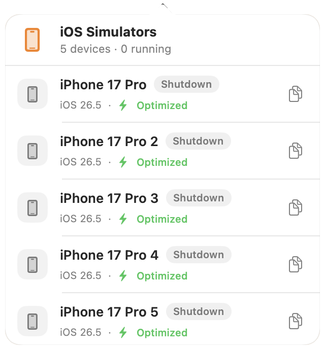

# SimSlim Menu

A macOS menu bar app for viewing and shutting down local iOS Simulators managed by [`simslim`](https://github.com/mobai-app/simslim).



Requires macOS 14, Xcode command-line tools, and `simslim`.

```sh
make app
open "dist/SimSlim Menu.app"
```
